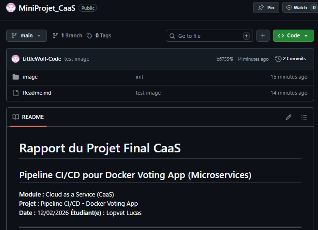

# 🗳️ MiniProjet CaaS — Pipeline CI/CD pour Docker Voting App

**Module :** Cloud as a Service (CaaS)  
**Projet :** Pipeline CI/CD — Docker Voting App (Microservices)  
**Date :** 12/02/2026  
**Étudiant :** Lopvet Lucas

---

## 📑 Table des matières

1. [Description du projet](#-description-du-projet)
2. [Architecture de l'application](#-architecture-de-lapplication)
3. [Architecture CI/CD](#-architecture-cicd)
4. [Structure du dépôt](#-structure-du-dépôt)
5. [Prérequis](#-prérequis)
6. [Étape 1 — Cloner le dépôt](#étape-1--cloner-le-dépôt)
7. [Étape 2 — Dockerisation](#étape-2--dockerisation-des-microservices)
8. [Étape 3 — Pipeline Jenkins (CI/CD)](#étape-3--pipeline-jenkins-cicd)
9. [Étape 4 — Déploiement Kubernetes](#étape-4--déploiement-kubernetes-minikube)
10. [Étape 5 — Monitoring (Prometheus + Grafana)](#étape-5--monitoring-prometheus--grafana)
11. [Résumé des ports et accès](#-résumé-des-ports-et-accès)
12. [Dépannage](#-dépannage)
13. [Conclusion](#-conclusion)

---

## 📖 Description du projet

Ce projet met en place une **chaîne CI/CD complète** pour déployer une application **microservices** (Docker Voting App) sur un cluster **Kubernetes** local (Minikube), avec du **monitoring** via Prometheus et Grafana.

L'objectif est de démontrer la maîtrise des outils DevOps suivants :

| Outil | Rôle |
|-------|------|
| **Git / GitHub** | Gestion du code source (versioning) |
| **Docker** | Conteneurisation des microservices |
| **Docker Hub** | Registre d'images Docker distantes |
| **Jenkins** | Automatisation de la pipeline CI/CD |
| **Kubernetes (Minikube)** | Orchestration et déploiement des conteneurs |
| **Prometheus + Grafana** | Monitoring et visualisation des métriques |

### Docker Voting App

Nous utilisons la **Docker Voting App**, application officielle de démonstration créée par Docker :  
🔗 [github.com/dockersamples/example-voting-app](https://github.com/dockersamples/example-voting-app)

C'est une application de **sondage en temps réel** :
1. L'utilisateur vote pour **« Cats »** ou **« Dogs »**
2. Les votes sont mis en file d'attente dans **Redis**
3. Un **Worker** traite les votes et les stocke dans **PostgreSQL**
4. Les **résultats** s'affichent en temps réel via WebSocket

---

## 🏗️ Architecture de l'application

### Diagramme des 5 microservices

```
┌─────────────────────────────────────────────────────────────────────────────┐
│                           DOCKER VOTING APP                                │
├─────────────────────────────────────────────────────────────────────────────┤
│                                                                             │
│   ┌────────────────┐                           ┌────────────────┐          │
│   │   🗳️ VOTE      │                           │   📊 RESULT    │          │
│   │  (Python Flask) │                           │   (Node.js)    │          │
│   │  Port: 80       │                           │   Port: 80     │          │
│   └───────┬────────┘                           └───────┬────────┘          │
│           │                                            │                    │
│           │ écrit les votes                            │ lit les résultats  │
│           ▼                                            │                    │
│   ┌────────────────┐       ┌────────────────┐          │                    │
│   │   🔴 REDIS     │──────▶│   ⚙️ WORKER    │          │                    │
│   │   (Cache/Queue) │       │   (.NET Core)  │          │                    │
│   │   Port: 6379   │       │                │          │                    │
│   └────────────────┘       └───────┬────────┘          │                    │
│                                    │                    │                    │
│                                    │ écrit              │ lit                │
│                                    ▼                    ▼                    │
│                           ┌──────────────────────────────┐                  │
│                           │   🐘 POSTGRESQL               │                  │
│                           │   (Base de données)           │                  │
│                           │   Port: 5432                  │                  │
│                           └──────────────────────────────┘                  │
└─────────────────────────────────────────────────────────────────────────────┘
```

### Détail des microservices

| Service | Langage | Port interne | Image Docker | Rôle |
|---------|---------|:------------:|-------------|------|
| **vote** | Python (Flask + Gunicorn) | 80 | `VOTRE_DOCKERHUB_USER/vote` | Interface web de vote |
| **result** | Node.js (Express + Socket.io) | 80 | `VOTRE_DOCKERHUB_USER/result` | Affichage des résultats en temps réel |
| **worker** | .NET Core 7 | — | `VOTRE_DOCKERHUB_USER/worker` | Traitement des votes (Redis → PostgreSQL) |
| **redis** | Redis | 6379 | `redis:alpine` | File d'attente temporaire des votes |
| **db** | PostgreSQL | 5432 | `postgres:15-alpine` | Stockage permanent des votes |

### Flux de données

```
Utilisateur ──▶ vote (Flask) ──▶ Redis ──▶ Worker (.NET) ──▶ PostgreSQL ──▶ result (Node.js) ──▶ Utilisateur
```

---

## 🔄 Architecture CI/CD

```
┌─────────────┐     git push     ┌─────────────┐     webhook     ┌─────────────┐
│ Développeur │ ───────────────▶ │   GitHub    │ ──────────────▶ │   Jenkins   │
└─────────────┘                  └─────────────┘                 └──────┬──────┘
                                                                        │
                                       ┌────────────────────────────────┘
                                       │  1. Checkout
                                       │  2. Build images
                                       │  3. Push images
                                       ▼
                                ┌─────────────┐
                                │ Docker Hub  │
                                └──────┬──────┘
                                       │
                                       │ 4. kubectl apply
                                       ▼
                                ┌─────────────┐
                                │ Kubernetes  │ ◀── Prometheus + Grafana
                                │  (Minikube) │     (Monitoring)
                                └─────────────┘
```

**Les 4 stages de la pipeline Jenkins :**

| Stage | Action |
|-------|--------|
| **Checkout** | Récupération du code depuis GitHub |
| **Build** | Construction des 3 images Docker (vote, result, worker) |
| **Push** | Envoi des images vers Docker Hub (avec tag `latest` + numéro de build) |
| **Deploy** | Déploiement sur Kubernetes via `kubectl apply -f k8s/` |

---

## 📁 Structure du dépôt

```
MiniProjet_CaaS/
├── vote/                          # Microservice VOTE (Python Flask)
│   ├── Dockerfile
│   ├── app.py
│   ├── requirements.txt
│   ├── static/
│   └── templates/
├── result/                        # Microservice RESULT (Node.js)
│   ├── Dockerfile
│   ├── server.js
│   ├── package.json
│   ├── views/
│   └── tests/
├── worker/                        # Microservice WORKER (.NET Core)
│   ├── Dockerfile
│   ├── Program.cs
│   └── Worker.csproj
├── k8s/                           # Manifests Kubernetes
│   ├── vote-deployment.yaml
│   ├── vote-service.yaml
│   ├── result-deployment.yaml
│   ├── result-service.yaml
│   ├── worker-deployment.yaml
│   ├── redis-deployment.yaml
│   ├── redis-service.yaml
│   ├── db-deployment.yaml
│   └── db-service.yaml
├── Jenkinsfile                    # Pipeline CI/CD
└── Readme.md                     # Ce fichier
```

---

## ✅ Prérequis

> **Toutes les commandes ci-dessous sont pour Ubuntu (22.04 LTS recommandé).**  
> La machine doit disposer d'au moins **8 Go de RAM** et **4 CPU**.

### Outils requis (déjà installés sur l'environnement de TP)

| Outil | Vérification |
|-------|-------------|
| Git | `git --version` |
| Docker | `docker --version` |
| Minikube | `minikube version` |
| kubectl | `kubectl version --client` |
| Jenkins | `systemctl status jenkins` |

### Vérification rapide de tous les outils

```bash

git --version
docker --version
minikube version
kubectl version --client
systemctl status jenkins --no-pager

```

> 📸 **CAPTURE D'ÉCRAN 1 :** Résultat de la vérification des outils (toutes les versions affichées)
>
> 

### Compte Docker Hub

Un compte **Docker Hub** est nécessaire pour pousser les images :
1. Créez un compte sur [hub.docker.com](https://hub.docker.com) si ce n'est pas déjà fait
2. Notez votre **identifiant** (ex : `monuser`) — il sera utilisé partout comme `VOTRE_DOCKERHUB_USER`

---

## Étape 1 — Cloner le dépôt

### 1.1 Cloner le repository

```bash
git clone https://github.com/LittleWolf-Code/MiniProjet_CaaS.git
cd MiniProjet_CaaS
```

> 📸 **CAPTURE D'ÉCRAN 2 :** Page du repository GitHub (vue d'ensemble)
>
> 
### 1.2 Vérifier la structure du projet

```bash
ls -la
# Vous devez voir : vote/  result/  worker/  k8s/  Jenkinsfile  Readme.md
```

> 📸 **CAPTURE D'ÉCRAN 3 :** Résultat du `ls -la` dans le terminal (structure du projet)
>
> 

---

## Étape 2 — Dockerisation des microservices

### 2.1 Construire les 3 images Docker

> ⚠️ **Remplacez `VOTRE_DOCKERHUB_USER` par votre identifiant Docker Hub** dans toutes les commandes.

```bash
# Définir la variable pour simplifier les commandes
export DOCKERHUB_USER="VOTRE_DOCKERHUB_USER"

# Build de l'image VOTE (Python Flask)
docker build -t $DOCKERHUB_USER/vote:latest ./vote

# Build de l'image RESULT (Node.js)
docker build -t $DOCKERHUB_USER/result:latest ./result

# Build de l'image WORKER (.NET Core)
docker build -t $DOCKERHUB_USER/worker:latest ./worker
```

> 📸 **CAPTURE D'ÉCRAN 4 :** Résultat du `docker build` (au moins un des 3 builds terminé avec succès)
>
> 

### 2.2 Tester les images localement (optionnel)

```bash
# Vérifier que les images ont été créées
docker images | grep $DOCKERHUB_USER
```

> 📸 **CAPTURE D'ÉCRAN 5 :** Liste des images Docker créées (`docker images`)
>
> 

### 2.3 Pousser les images vers Docker Hub

```bash
# Se connecter à Docker Hub
docker login

# Push des 3 images
docker push $DOCKERHUB_USER/vote:latest
docker push $DOCKERHUB_USER/result:latest
docker push $DOCKERHUB_USER/worker:latest
```

> 📸 **CAPTURE D'ÉCRAN 6 :** Push réussi vers Docker Hub (terminal)
>
> 

> 📸 **CAPTURE D'ÉCRAN 7 :** Page Docker Hub montrant les images poussées
>
> 

### 2.4 Mettre à jour les manifests Kubernetes

Remplacez `VOTRE_DOCKERHUB_USER` dans les fichiers de déploiement :

```bash
# Remplacer le placeholder dans tous les fichiers k8s
sed -i "s/VOTRE_DOCKERHUB_USER/$DOCKERHUB_USER/g" k8s/vote-deployment.yaml
sed -i "s/VOTRE_DOCKERHUB_USER/$DOCKERHUB_USER/g" k8s/result-deployment.yaml
sed -i "s/VOTRE_DOCKERHUB_USER/$DOCKERHUB_USER/g" k8s/worker-deployment.yaml
```

Mettre aussi à jour le `Jenkinsfile` :

```bash
sed -i "s/VOTRE_DOCKERHUB_USER/$DOCKERHUB_USER/g" Jenkinsfile
```

---

## Étape 3 — Pipeline Jenkins (CI/CD)

### 3.1 Accéder à Jenkins

```bash
# Vérifier que Jenkins est en cours d'exécution
sudo systemctl start jenkins
sudo systemctl status jenkins

# Récupérer le mot de passe admin initial (si première connexion)
sudo cat /var/lib/jenkins/secrets/initialAdminPassword
```

Accéder à Jenkins via le navigateur : **http://localhost:8080**

> 📸 **CAPTURE D'ÉCRAN 8 :** Page d'accueil de Jenkins (dashboard)
>
> 

### 3.2 Installer les plugins nécessaires

Dans **Manage Jenkins** → **Manage Plugins** → **Available**, installer :
- ✅ **Git plugin**
- ✅ **Docker Pipeline**
- ✅ **Pipeline**
- ✅ **Kubernetes CLI**

### 3.3 Configurer les credentials Docker Hub

1. Aller dans **Manage Jenkins** → **Manage Credentials**
2. Cliquer sur **(global)** → **Add Credentials**
3. Remplir :

| Champ | Valeur |
|-------|--------|
| **Kind** | Username with password |
| **Username** | Votre identifiant Docker Hub |
| **Password** | Votre mot de passe Docker Hub |
| **ID** | `dockerhub-credentials` |
| **Description** | Docker Hub Credentials |

> 📸 **CAPTURE D'ÉCRAN 9 :** Configuration des credentials Docker Hub dans Jenkins
>
> 

### 3.4 Ajouter Jenkins au groupe Docker

```bash
# Permettre à Jenkins d'exécuter les commandes Docker
sudo usermod -aG docker jenkins
sudo systemctl restart jenkins
```

### 3.5 Configurer kubectl pour Jenkins

```bash
# Copier la config kubectl pour l'utilisateur jenkins
sudo mkdir -p /var/lib/jenkins/.kube
sudo cp ~/.kube/config /var/lib/jenkins/.kube/config
sudo chown -R jenkins:jenkins /var/lib/jenkins/.kube
```

### 3.6 Créer la pipeline Jenkins

1. Dans Jenkins, cliquer sur **New Item**
2. Nom : `MiniProjet-CaaS`
3. Type : **Pipeline**
4. Configuration :
   - **Pipeline** → **Definition** : `Pipeline script from SCM`
   - **SCM** : Git
   - **Repository URL** : `https://github.com/LittleWolf-Code/MiniProjet_CaaS.git`
   - **Branch** : `*/main`
   - **Script Path** : `Jenkinsfile`
5. Cliquer sur **Save**

### 3.7 Lancer la pipeline

Cliquer sur **Build Now** et observer les 4 stages :
1. ✅ Checkout
2. ✅ Build Docker Images
3. ✅ Push to Docker Hub
4. ✅ Deploy to Kubernetes

> 📸 **CAPTURE D'ÉCRAN 10 :** Pipeline Jenkins avec les 4 stages réussis (vue Stage View)
>
> 

> 📸 **CAPTURE D'ÉCRAN 11 :** Console Output du build Jenkins (résultat SUCCESS)
>
> 

---

## Étape 4 — Déploiement Kubernetes (Minikube)

### 4.1 Démarrer Minikube

```bash
# Démarrer le cluster Minikube avec suffisamment de ressources
minikube start --driver=docker --cpus=4 --memory=4096

# Vérifier que le cluster est actif
kubectl cluster-info
kubectl get nodes
```

### 4.2 Déployer tous les services

```bash
# Appliquer tous les manifests Kubernetes d'un coup
kubectl apply -f k8s/
```

Résultat attendu :
```
deployment.apps/redis created
service/redis created
deployment.apps/db created
service/db created
deployment.apps/vote created
service/vote created
deployment.apps/result created
service/result created
deployment.apps/worker created
```

### 4.3 Vérifier le déploiement

```bash
# Vérifier que tous les pods sont en état Running
kubectl get pods

# Vérifier les services
kubectl get services

# Vérifier les déploiements
kubectl get deployments
```

Tous les pods doivent être en état **Running** (ça peut prendre 1-2 minutes) :
```
NAME                      READY   STATUS    RESTARTS   AGE
db-xxxxx                  1/1     Running   0          1m
redis-xxxxx               1/1     Running   0          1m
vote-xxxxx                1/1     Running   0          1m
vote-yyyyy                1/1     Running   0          1m
result-xxxxx              1/1     Running   0          1m
worker-xxxxx              1/1     Running   0          1m
```

> 📸 **CAPTURE D'ÉCRAN 12 :** Résultat de `kubectl get pods` (tous les pods en Running)
>
> 

> 📸 **CAPTURE D'ÉCRAN 13 :** Résultat de `kubectl get services` (tous les services actifs)
>
> 

### 4.4 Accéder à l'application

```bash
# Obtenir l'URL du service vote (interface de vote)
minikube service vote --url
# → Ouvre http://<minikube-ip>:31000

# Obtenir l'URL du service result (résultats en temps réel)
minikube service result --url
# → Ouvre http://<minikube-ip>:31001
```

| Service | Accès |
|---------|-------|
| **Vote** (voter) | `http://<MINIKUBE_IP>:31000` |
| **Result** (résultats) | `http://<MINIKUBE_IP>:31001` |

### 4.5 Tester l'application

1. Ouvrir l'interface **vote** → voter pour « Cats » ou « Dogs »
2. Ouvrir l'interface **result** → constater que le vote apparaît en temps réel
3. Voter plusieurs fois → les pourcentages changent en direct

> 📸 **CAPTURE D'ÉCRAN 14 :** Interface de vote (page web Cats vs Dogs)
>
> 

> 📸 **CAPTURE D'ÉCRAN 15 :** Page des résultats en temps réel
>
> 

---

## Étape 5 — Monitoring (Prometheus + Grafana)

### 5.1 Installer Helm (si pas déjà installé)

```bash
# Installer Helm
curl https://raw.githubusercontent.com/helm/helm/main/scripts/get-helm-3 | bash

# Vérifier
helm version
```

### 5.2 Installer kube-prometheus-stack

```bash
# Ajouter le repo Helm de Prometheus
helm repo add prometheus-community https://prometheus-community.github.io/helm-charts
helm repo update

# Installer la stack complète (Prometheus + Grafana + AlertManager)
helm install monitoring prometheus-community/kube-prometheus-stack \
  --namespace monitoring \
  --create-namespace \
  --set grafana.adminPassword=admin
```

### 5.3 Accéder à Grafana

```bash
# Exposer Grafana via port-forward
kubectl port-forward -n monitoring svc/monitoring-grafana 3000:80 &
```

Ouvrir dans le navigateur : **http://localhost:3000**

| Champ | Valeur |
|-------|--------|
| **Login** | `admin` |
| **Mot de passe** | `admin` |

### 5.4 Importer un dashboard Kubernetes

1. Dans Grafana, aller dans **Dashboards** → **Import**
2. Entrer l'ID du dashboard : **`15661`** (Kubernetes Cluster Monitoring)
3. Cliquer sur **Load** → sélectionner la datasource **Prometheus** → **Import**

> 📸 **CAPTURE D'ÉCRAN 16 :** Dashboard Grafana avec les métriques Kubernetes
>
> 

Dashboards recommandés :

| ID | Dashboard |
|----|-----------|
| **15661** | Kubernetes Cluster Monitoring |
| **6417** | Kubernetes Pods Monitoring |
| **315** | Kubernetes Cluster Overview |

### 5.5 Accéder à Prometheus (optionnel)

```bash
# Exposer Prometheus via port-forward
kubectl port-forward -n monitoring svc/monitoring-kube-prometheus-prometheus 9090:9090 &
```

Ouvrir : **http://localhost:9090**

> 📸 **CAPTURE D'ÉCRAN 17 :** Interface Prometheus avec une requête exécutée
>
> 

### 5.6 Exemples de requêtes Prometheus

```promql
# Utilisation CPU par pod
sum(rate(container_cpu_usage_seconds_total{namespace="default"}[5m])) by (pod)

# Mémoire utilisée par pod
sum(container_memory_usage_bytes{namespace="default"}) by (pod)

# Nombre de pods en running
count(kube_pod_status_phase{phase="Running", namespace="default"})
```

---

## 🌐 Résumé des ports et accès

| Service | Type | Port | URL |
|---------|------|:----:|-----|
| **Vote** (frontend) | NodePort | 31000 | `http://<MINIKUBE_IP>:31000` |
| **Result** (frontend) | NodePort | 31001 | `http://<MINIKUBE_IP>:31001` |
| **Redis** | ClusterIP | 6379 | Interne uniquement |
| **PostgreSQL** | ClusterIP | 5432 | Interne uniquement |
| **Jenkins** | Local | 8080 | `http://localhost:8080` |
| **Grafana** | Port-forward | 3000 | `http://localhost:3000` |
| **Prometheus** | Port-forward | 9090 | `http://localhost:9090` |

Pour récupérer l'IP de Minikube :
```bash
minikube ip
```

---

## 🔧 Dépannage

### Pods en CrashLoopBackOff

```bash
# Voir les logs d'un pod en erreur
kubectl logs <nom-du-pod>

# Décrire un pod pour voir les événements
kubectl describe pod <nom-du-pod>
```

### Minikube ne démarre pas

```bash
# Supprimer et recréer le cluster
minikube delete
minikube start --driver=docker --cpus=4 --memory=4096
```

### Docker permission denied

```bash
# Ajouter votre utilisateur au groupe docker
sudo usermod -aG docker $USER
newgrp docker
```

### Jenkins ne peut pas accéder à Docker

```bash
sudo usermod -aG docker jenkins
sudo systemctl restart jenkins
```

### Réinitialiser tout le déploiement Kubernetes

```bash
# Supprimer tous les déploiements
kubectl delete -f k8s/

# Redéployer
kubectl apply -f k8s/
```

---

## 🎯 Conclusion

Ce projet démontre la mise en place d'une **chaîne DevOps complète** :

| Étape | Réalisation |
|-------|------------|
| **1. Code source** | ✅ Repository GitHub public avec code source structuré |
| **2. Dockerisation** | ✅ 3 images Docker (vote, result, worker) construites et poussées sur Docker Hub |
| **3. CI/CD** | ✅ Pipeline Jenkins automatisée (Checkout → Build → Push → Deploy) |
| **4. Orchestration** | ✅ Déploiement Kubernetes avec 5 services sur Minikube |
| **5. Monitoring** | ✅ Prometheus + Grafana pour la supervision du cluster |

**Technologies utilisées :** Git, GitHub, Docker, Docker Hub, Jenkins, Kubernetes (Minikube), Helm, Prometheus, Grafana

---

> **Auteur :** Lopvet Lucas  
> **Module :** Cloud as a Service (CaaS)  
> **Date :** 12/02/2026