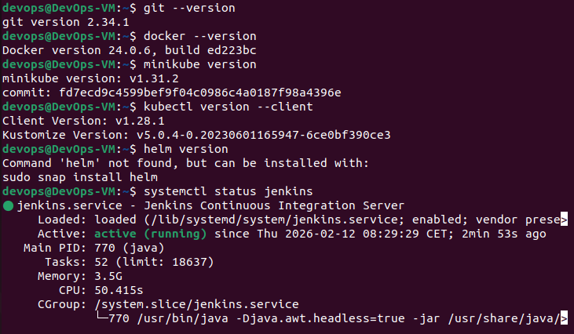

# Rapport du Projet Final CaaS
## Pipeline CI/CD pour Docker Voting App (Microservices)

**Module :** Cloud as a Service (CaaS)  
**Projet :** Pipeline CI/CD - Docker Voting App  
**Date :** 12/02/2026
**Étudiant(e) :** Lopvet Lucas  

---

## Table des matières

1. [Introduction](#introduction)
2. [Présentation de l'application](#présentation-de-lapplication)
3. [Environnement de travail](#environnement-de-travail)
4. [Étape 1 : Référentiel de code source](#étape-1--référentiel-de-code-source)
5. [Étape 2 : Dockerisation de l'application](#étape-2--dockerisation-de-lapplication)
6. [Étape 3 : Pipeline Jenkins](#étape-3--pipeline-jenkins)
7. [Étape 4 : Déploiement Kubernetes](#étape-4--déploiement-kubernetes)
8. [Étape 5 : Monitoring Prometheus + Grafana](#étape-5--monitoring-prometheus--grafana)
9. [Conclusion](#conclusion)

---

## Introduction

### Objectif du projet

Ce projet met en place une chaîne **CI/CD complète** pour une application **microservices** en utilisant :

| Outil | Rôle |
|-------|------|
| **GitHub** | Hébergement du code source |
| **Docker** | Conteneurisation |
| **Jenkins** | Automatisation CI/CD |
| **Kubernetes** | Orchestration |
| **Prometheus + Grafana** | Monitoring |

---

## Présentation de l'application

### Docker Voting App

Nous utilisons la **Docker Voting App**, une application de démonstration officielle créée par Docker pour illustrer une architecture microservices.

**Lien officiel :** https://github.com/dockersamples/example-voting-app

### Fonctionnalité

Application de **sondage en temps réel** :
1. L'utilisateur vote pour **"Cats"** ou **"Dogs"**
2. Les votes sont traités et stockés
3. Les résultats s'affichent en temps réel

### Architecture (5 microservices)

```
┌─────────────────────────────────────────────────────────────────────┐
│                        VOTING APP                                    │
├─────────────────────────────────────────────────────────────────────┤
│                                                                      │
│   ┌───────────────┐                        ┌───────────────┐        │
│   │   🗳️ VOTE     │                        │   📊 RESULT   │        │
│   │   (Python)    │                        │   (Node.js)   │        │
│   │   Port: 5000  │                        │   Port: 5001  │        │
│   └───────┬───────┘                        └───────┬───────┘        │
│           │                                        │                 │
│           │ écrit                                  │ lit             │
│           ▼                                        │                 │
│   ┌───────────────┐      ┌───────────────┐        │                 │
│   │   🔴 REDIS    │──────│   ⚙️ WORKER   │        │                 │
│   │   (Cache)     │      │   (.NET)      │        │                 │
│   │   Port: 6379  │      │               │        │                 │
│   └───────────────┘      └───────┬───────┘        │                 │
│                                  │                 │                 │
│                                  │ écrit           │ lit             │
│                                  ▼                 ▼                 │
│                         ┌─────────────────────────────┐             │
│                         │   🐘 POSTGRESQL              │             │
│                         │   (Base de données)         │             │
│                         │   Port: 5432                │             │
│                         └─────────────────────────────┘             │
└─────────────────────────────────────────────────────────────────────┘
```

### Les 5 microservices

| Service | Langage | Port | Rôle |
|---------|---------|------|------|
| **vote** | Python Flask | 5000 | Interface de vote |
| **result** | Node.js | 5001 | Affichage résultats |
| **worker** | .NET Core | - | Traitement votes |
| **redis** | Redis | 6379 | Queue temporaire |
| **db** | PostgreSQL | 5432 | Stockage permanent |

---

## Environnement de travail

### Machine virtuelle

| Caractéristique | Valeur |
|-----------------|--------|
| **Système** | Ubuntu 22.04 LTS |
| **RAM** | 16 Go minimum |
| **CPU** | 10 cores |
| **Disque** | 50 Go |

🔴 problème  : l'ecran de la virtual machine clignote en noir
- modification des caractéristique de la VM de 4Go de RAM a 16Go de RAM, passage a 10 Cores CPU

### Vérification des outils

```bash
git --version
docker --version
minikube version
kubectl version --client
helm version
systemctl status jenkins
```

