# 🗳️ MiniProjet CaaS — Pipeline CI/CD pour Docker Voting App

**Module :** Cloud as a Service (CaaS)  
**Projet :** Pipeline CI/CD — Docker Voting App (Microservices)  
**Date :** 12/02/2026  
**Étudiant :** Lopvet Lucas


---

# 0 — Discussion sur l'idée de l'application

## Application choisie : Docker Voting App

Nous utilisons la **Docker Voting App**, application officielle de démonstration créée par Docker :  
🔗 [github.com/dockersamples/example-voting-app](https://github.com/dockersamples/example-voting-app)

C'est une application de **sondage en temps réel** : l'utilisateur vote pour **« Cats »** ou **« Dogs »**, et les résultats s'affichent instantanément.

## Architecture : Microservices (5 composants)

```
┌─────────────────────────────────────────────────────────────────────────────┐
│                           DOCKER VOTING APP                                │
├─────────────────────────────────────────────────────────────────────────────┤
│                                                                             │
│   ┌────────────────┐                           ┌────────────────┐          │
│   │   🗳️ VOTE      │                           │   📊 RESULT    │          │
│   │  (Python Flask) │                           │   (Node.js)    │          │
│   │  Port: 80       │                           │   Port: 80     │          │
│   └───────┬────────┘                           └───────┬────────┘          │
│           │                                            │                    │
│           │ écrit les votes                            │ lit les résultats  │
│           ▼                                            │                    │
│   ┌────────────────┐       ┌────────────────┐          │                    │
│   │   🔴 REDIS     │──────▶│   ⚙️ WORKER    │          │                    │
│   │   (Cache/Queue) │       │   (.NET Core)  │          │                    │
│   │   Port: 6379   │       │                │          │                    │
│   └────────────────┘       └───────┬────────┘          │                    │
│                                    │                    │                    │
│                                    │ écrit              │ lit                │
│                                    ▼                    ▼                    │
│                           ┌──────────────────────────────┐                  │
│                           │   🐘 POSTGRESQL               │                  │
│                           │   (Base de données)           │                  │
│                           │   Port: 5432                  │                  │
│                           └──────────────────────────────┘                  │
└─────────────────────────────────────────────────────────────────────────────┘
```
> 📸 **CAPTURE :** vote
>
> 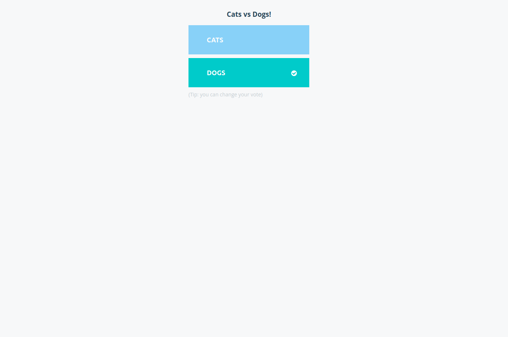

> 📸 **CAPTURE :** result
>
> 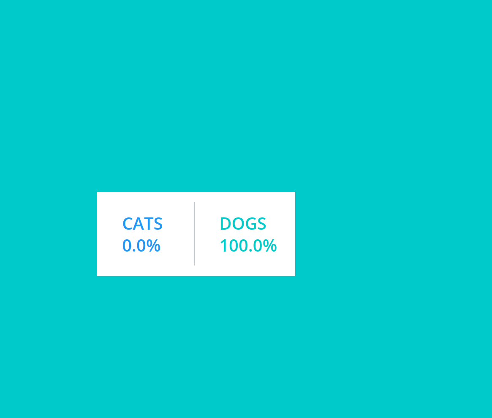


...

**Flux de données :**
```
Utilisateur ──▶ vote (Flask) ──▶ Redis ──▶ Worker (.NET) ──▶ PostgreSQL ──▶ result (Node.js) ──▶ Utilisateur
```

## Langages / Frameworks

| Service | Langage | Framework | Rôle |
|---------|---------|-----------|------|
| **vote** | Python | Flask + Gunicorn | Interface web de vote |
| **result** | Node.js | Express + Socket.io | Affichage des résultats en temps réel (WebSocket) |
| **worker** | C# (.NET 7) | — | Traitement des votes (Redis → PostgreSQL) |

## Bases de données — Justification du choix

| Base | Rôle | Pourquoi ce choix |
|------|------|-------------------|
| **Redis** | File d'attente temporaire (cache) | Ultra-rapide en mémoire, parfait pour du stockage temporaire de votes en attente. Structure `list` (RPUSH/LPOP) idéale pour une file d'attente |
| **PostgreSQL** | Stockage permanent des votes | Base relationnelle robuste, support ACID pour la persistance. Requêtes SQL pour l'agrégation des résultats (`COUNT`, `GROUP BY`) |

> **Pourquoi 2 bases ?** Redis sert de **tampon** entre le frontend (vote) et le backend (worker), ce qui découple l'écriture de la lecture. Le worker traite les votes à son rythme et les persiste dans PostgreSQL. Cela garantit la **résilience** (les votes ne sont pas perdus si le worker redémarre).

## Architecture CI/CD

```
┌─────────────┐     git push     ┌─────────────┐     webhook     ┌─────────────┐
│ Développeur │ ───────────────▶ │   GitHub    │ ──────────────▶ │   Jenkins   │
└─────────────┘                  └─────────────┘                 └──────┬──────┘
                                                                        │
                                       ┌────────────────────────────────┘
                                       │  1. Checkout
                                       │  2. Build images
                                       │  3. Push images
                                       ▼
                                ┌─────────────┐
                                │ Docker Hub  │
                                └──────┬──────┘
                                       │
                                       │ 4. kubectl apply
                                       ▼
                                ┌─────────────┐
                                │ Kubernetes  │ ◀── Prometheus + Grafana
                                │  (Minikube) │     (Monitoring)
                                └─────────────┘
```

---

# 🚀 Guide de réalisation pas à pas

> **Ce guide suppose une machine Ubuntu avec les outils suivants déjà installés :**  
> Git, Docker, Minikube, kubectl, Jenkins  
> La machine doit avoir au moins **8 Go de RAM** et **4 CPU**.

---

## Étape 1 — Vérifier les outils pré-installés

```bash
git --version
docker --version
minikube version
kubectl version --client
```

Vérifier que Docker fonctionne sans sudo :

```bash
docker ps
```

> Si « permission denied » :
> ```bash
> sudo usermod -aG docker $USER
> newgrp docker
> ```

> 📸 **CAPTURE :** Versions de tous les outils affichées
>
> 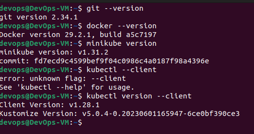

---

## Étape 2 — Cloner le dépôt et se placer sur la branche

```bash
cd ~
git clone https://github.com/LittleWolf-Code/MiniProjet_CaaS.git
cd MiniProjet_CaaS

```

Vérifier la structure :

```bash
ls -la
# Attendu : vote/  result/  worker/  k8s/  jenkins/  Jenkinsfile  Readme.md
```

> 📸 **CAPTURE :** Repository cloné + `ls -la`
>
> 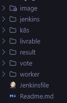

---

## Étape 3 — Démarrer Minikube

```bash
minikube start --driver=docker --cpus=4 --memory=4096
```

Vérifier :

```bash
kubectl cluster-info
kubectl get nodes
```

> 📸 **CAPTURE :** Minikube démarré + `kubectl get nodes`
>
> 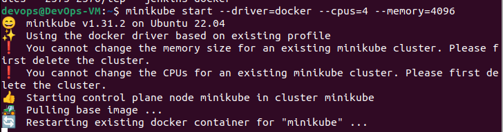

---

## Étape 4 — Construire et pousser les images Docker manuellement

> ⚠️ **Remplacez `litlewolf` par votre identifiant Docker Hub si différent.**

```bash
export DOCKERHUB_USER="litlewolf"

# Build des 3 images
docker build -t $DOCKERHUB_USER/vote:latest ./vote
docker build -t $DOCKERHUB_USER/result:latest ./result
docker build -t $DOCKERHUB_USER/worker:latest ./worker
```

Vérifier :

```bash
docker images | grep $DOCKERHUB_USER
```

Pousser vers Docker Hub :

```bash
docker login
# Entrer votre identifiant et mot de passe Docker Hub

docker push $DOCKERHUB_USER/vote:latest
docker push $DOCKERHUB_USER/result:latest
docker push $DOCKERHUB_USER/worker:latest
```

> 📸 **CAPTURE :** `docker images` montrant les 3 images
>
> 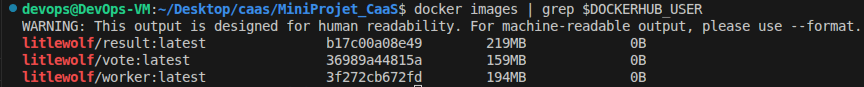

> 📸 **CAPTURE :** Push réussi vers Docker Hub
>
> 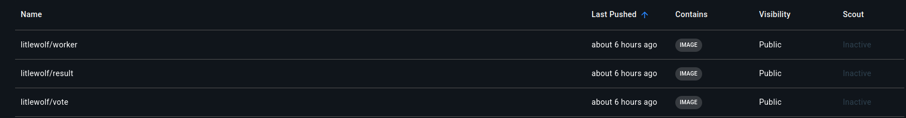

---

## Étape 5 — Déployer sur Kubernetes

```bash
# Appliquer tous les manifests d'un coup
kubectl apply -f k8s/
```

Attendre que tout soit prêt :

```bash
kubectl rollout status deployment/vote
kubectl rollout status deployment/result
kubectl rollout status deployment/worker
kubectl rollout status deployment/redis
kubectl rollout status deployment/db
```

Vérifier :

```bash
kubectl get pods
kubectl get svc
kubectl get deploy
```

> Tous les pods doivent être en état **Running** (attendre 1-2 min si nécessaire).

Accéder à l'application :

```bash
minikube service vote --url
# → Ouvrir l'URL dans le navigateur (port 31000)

minikube service result --url
# → Ouvrir l'URL (port 31001)
```

**Tester :** Voter pour Cats ou Dogs → vérifier les résultats en temps réel.

> 📸 **CAPTURE :** `kubectl` — tous Running

> 


---

## Étape 6 — Installer Jenkins dockerisé

```bash
# Créer le réseau minikube pour que Jenkins puisse communiquer avec le cluster
docker network create minikube 2>/dev/null || true
```

```bash
# Lancer Jenkins + Docker-in-Docker
cd ~/MiniProjet_CaaS/jenkins
sudo systemctl stop jenkins
sudo systemctl disable jenkins
docker compose up -d

```

Vérifier que les conteneurs tournent :

```bash
docker ps | grep jenkins
# Attendu : jenkins-blueocean (Jenkins) + jenkins-docker (DinD)
```

Récupérer le mot de passe admin initial :

```bash
# Attendre ~30 secondes que Jenkins démarre
sleep 30
docker exec jenkins-blueocean cat /var/jenkins_home/secrets/initialAdminPassword
```

Ouvrir Jenkins dans le navigateur : **http://localhost:8080**

1. Coller le mot de passe admin initial
2. Choisir **« Install suggested plugins »** → attendre l'installation
3. Créer un utilisateur admin (ou continuer avec admin)

> 📸 **CAPTURE :** Jenkins dashboard après installation
>
> 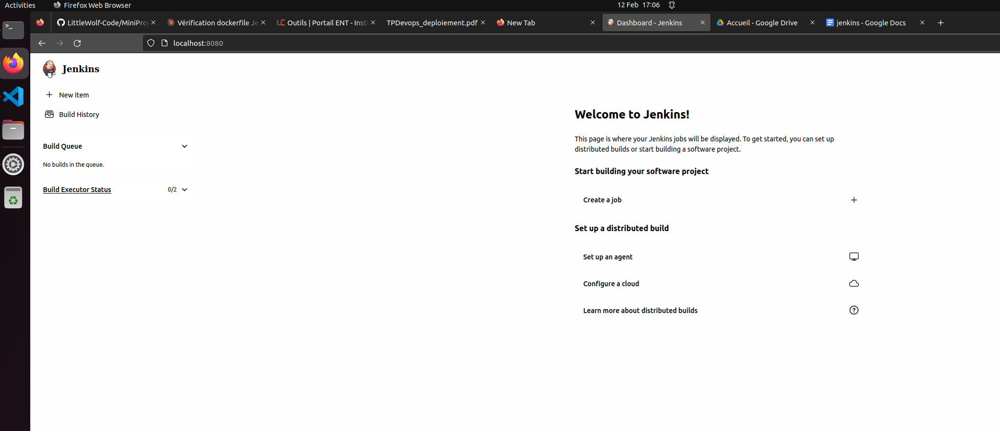

---

## Étape 7 — Configurer les credentials Docker Hub dans Jenkins

1. Dans Jenkins, aller dans **Manage Jenkins** → **Credentials**
2. Cliquer sur **(global)** → **Add Credentials**
3. Remplir :

| Champ | Valeur |
|-------|--------|
| **Kind** | Username with password |
| **Username** | Votre identifiant Docker Hub |
| **Password** | Votre mot de passe Docker Hub |
| **ID** | `dockerhub-credentials` |
| **Description** | Docker Hub Credentials |

4. Cliquer **Create**

> 📸 **CAPTURE :** Credentials Docker Hub configurés
>
> 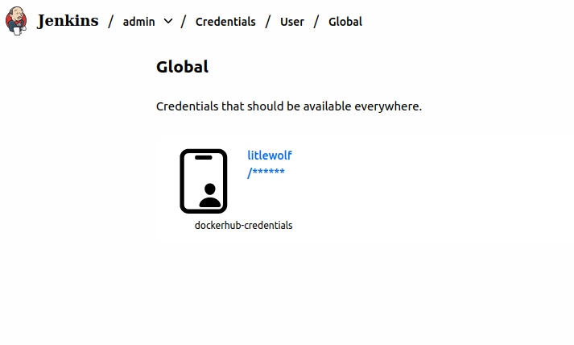

---

## Étape 8 — Copier la config kubectl dans Jenkins

```bash
kubectl config view --flatten > /tmp/kubeconfig-flat
# Copier la config kubeconfig dans le conteneur Jenkins
docker cp /tmp/kubeconfig-flat jenkins-blueocean:/home/jenkins/.kube/config

# Corriger les permissions
docker exec -u root jenkins-blueocean chown -R jenkins:jenkins /home/jenkins/.kube
```

Vérifier que Jenkins peut accéder au cluster :

```bash
docker exec jenkins-blueocean kubectl get nodes
# Attendu : le nœud minikube affiché
```

> **Si ça ne marche pas :** le problème est souvent que l'adresse du cluster dans kubeconfig pointe vers `127.0.0.1` mais Jenkins est dans un conteneur Docker. Solution :
>
> ```bash
> # Récupérer l'IP de minikube accessible depuis le réseau Docker
> MINIKUBE_IP=$(minikube ip)
>
> # Remplacer l'adresse dans la config copiée
> docker exec jenkins-blueocean sed -i "s|https://127.0.0.1:[0-9]*|https://$MINIKUBE_IP:8443|g" /home/jenkins/.kube/config
> docker exec jenkins-blueocean sed -i "s|certificate-authority: .*|insecure-skip-tls-verify: true|g" /home/jenkins/.kube/config
>
> # Re-tester
> docker exec jenkins-blueocean kubectl get nodes
> ```

---

## Étape 9 — Créer et lancer la pipeline Jenkins

1. Dans Jenkins, cliquer sur **New Item**
2. Nom : `MiniProjet-CaaS`
3. Type : **Pipeline**
4. Configuration :
   - **Pipeline** → **Definition** : `Pipeline script from SCM`
   - **SCM** : Git
   - **Repository URL** : `https://github.com/LittleWolf-Code/MiniProjet_CaaS.git`
   - **Branch** : `*/main`
   - **Script Path** : `Jenkinsfile`
5. Cliquer **Save**

6. Cliquer **Build Now** → observer les 4 stages :
   - ✅ Checkout
   - ✅ Build Docker Images
   - ✅ Push to Docker Hub
   - ✅ Deploy to Kubernetes


> 📸 **CAPTURE :** Console Output — SUCCESS
>
> 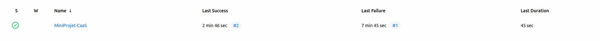

---

## Étape 10 — Installer Helm

```bash
curl https://raw.githubusercontent.com/helm/helm/main/scripts/get-helm-3 | bash
helm version
```

---

## Étape 11 — Installer le monitoring (Prometheus + Grafana)

```bash
# Ajouter le repo Helm de Prometheus
helm repo add prometheus-community https://prometheus-community.github.io/helm-charts
helm repo update

# Installer la stack complète
helm install monitoring prometheus-community/kube-prometheus-stack \
  --namespace monitoring \
  --create-namespace \
  --set grafana.adminPassword=admin
```

Attendre que tous les pods soient prêts (~2-3 minutes) :

```bash
kubectl get pods -n monitoring
# Attendre que tout soit Running (relancer si nécessaire)
```

---

## Étape 12 — Accéder à Grafana

```bash
# Exposer Grafana
kubectl port-forward -n monitoring svc/monitoring-grafana 3000:80 &
```

Ouvrir : **http://localhost:3000**

| Champ | Valeur |
|-------|--------|
| **Login** | `admin` |
| **Mot de passe** | `admin` |

### Importer un dashboard

1. **Dashboards** → **Import**
2. Entrer l'ID : **`15661`** → **Load** → sélectionner datasource **Prometheus** → **Import**

Dashboards recommandés :

| ID | Dashboard |
|----|---------:|
| **15661** | Kubernetes Cluster Monitoring |
| **6417** | Kubernetes Pods Monitoring |
| **315** | Kubernetes Cluster Overview |

> 📸 **CAPTURE :** Dashboard Grafana avec métriques CPU/mémoire
>
> 

### Accéder à Prometheus (optionnel)

```bash
kubectl port-forward -n monitoring svc/monitoring-kube-prometheus-prometheus 9090:9090 &
```

Ouvrir : **http://localhost:9090**

Requêtes utiles :

```promql
# CPU par pod
sum(rate(container_cpu_usage_seconds_total{namespace="default"}[5m])) by (pod)

# Mémoire par pod
sum(container_memory_usage_bytes{namespace="default"}) by (pod)
```

> 📸 **CAPTURE :** Prometheus avec requête exécutée
>
> 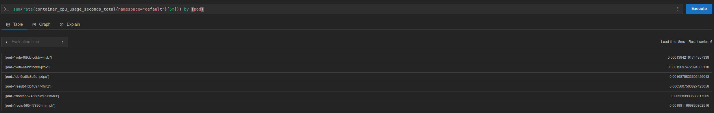

---

## 🌐 Résumé des ports et accès

| Service | Type | Port | URL |
|---------|------|:----:|-----|
| **Vote** | NodePort | 31000 | `http://<MINIKUBE_IP>:31000` |
| **Result** | NodePort | 31001 | `http://<MINIKUBE_IP>:31001` |
| **Redis** | ClusterIP | 6379 | Interne |
| **PostgreSQL** | ClusterIP | 5432 | Interne |
| **Jenkins** | Docker | 8080 | `http://localhost:8080` |
| **Grafana** | Port-forward | 3000 | `http://localhost:3000` |
| **Prometheus** | Port-forward | 9090 | `http://localhost:9090` |

```bash
minikube ip    # Récupérer l'IP de Minikube
```

---
